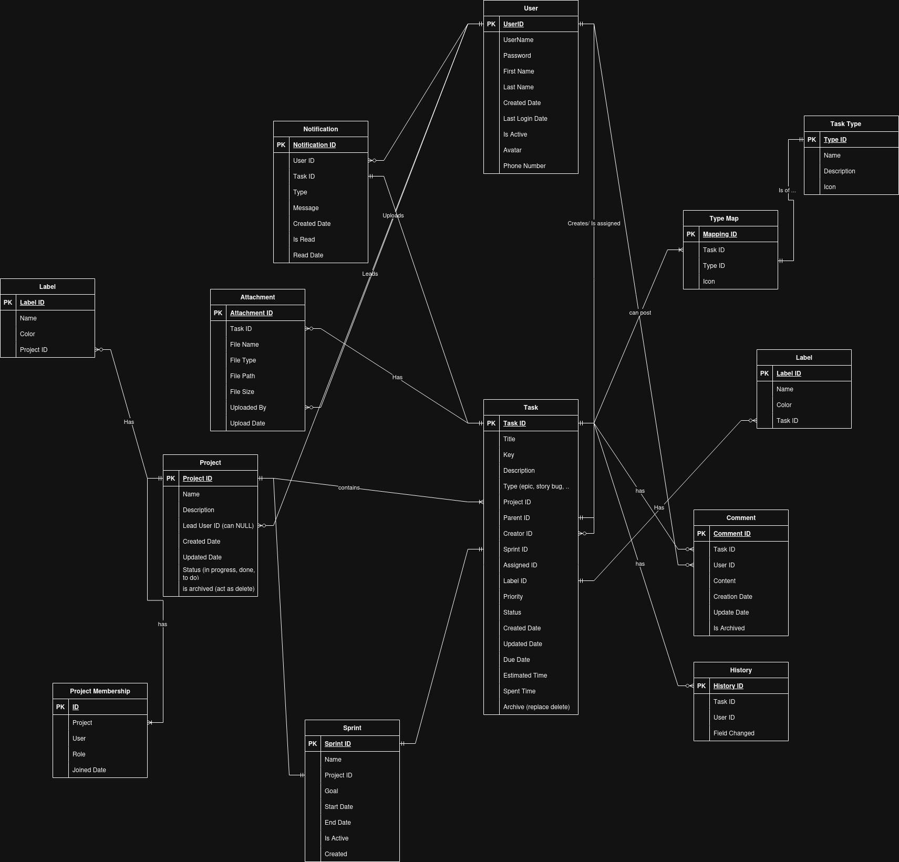

# Jira-like Task Management ERD

system that replicates Jira's functionality

## Entities and Relationships
### User

> **AbstractUser** can help reduce typing needs

    UserID (PK)
    Username
    Email
    Password
    FirstName
    LastName
    JoinDate
    LastLoginDate
    IsActive

> Custom properties

    Avatar Image
    PhoneNumber 

> Data will be printed from newest to oldest user 
> 
> Users can be 
>   - creators of tasks
>   - assigned tasks 
>   - watch tasks 

---
### Project

    ProjectID (PK)
    Name
    Key
    Description
    LeadUserID (FK to User)
    CreatedDate
    UpdatedDate
    Status

> Data will be printed from newest to oldest user 

### Project Membership 
```shell
# allowed behavior
- **User A** can be in **Project 1**
- **User A** can be in **Project 2**  
- **User B** can be in **Project 1**

### What This Prevents:

⚠️ **User A** cannot be in **Project 1** twice (even with different roles)
```

Database Records Example:
```
| ID | Project | User    | Role      |
|----|---------|---------|-----------|
| 1  | Proj-1  | Alice   | Admin     | ✓ Allowed
| 2  | Proj-1  | Bob     | Developer | ✓ Allowed  
| 3  | Proj-2  | Alice   | Developer | ✓ Allowed (different project)
| 4  | Proj-1  | Alice   | Developer | ❌ BLOCKED! (Alice already in Proj-1)
```
    
    MemebershipID
    ProjectID
    UserID
    Role
    JoinedDate
---
### Sprint

The fixed time required to complete a given project
    
    SprintID
    Name
    Goal
    StartDate
    EndDate
    IsActive
    CreatedDate
> Print DSA-18 Proficiency[sprint name]
    
---

### Task

    TaskID (PK)
    Title
    Key (like DSA-18, ...)
    Description
    ProjectID (FK to Project)
    ParentID (Self Reference)
    SprintID
    CreatorUserID (FK to User)
    AssigneeUserID (FK to User)
    WatcherUserID (FK to User)
    Priority (critical, high, moderate, low)
    Status (restricted to: To Do, In Progress, Done; can be infered from title)
    Completion Progess (story points)
    CreatedDate
    UpdatedDate
    DueDate
    EstimatedTime
    SpentTime
    IsArchived (instead of delete functionality)
> indexed by 
---
### Comment

    CommentID (PK)
    TaskID (FK to Task)
    PostedBy (FK to User)
    Content
    CreatedDate
    UpdatedDate
    IsArchived (instead of delete functionality)
    ParentComment (Self Reference)
    
> Ordered from oldest to newest
---
# Attachment

    AttachmentID (PK)
    TaskID (FK to Task)
    File
    FileName
    FileType
    FilePath
    FileSize
    UploadedBy (FK to User)
    UploadDate
    Description

> Ordered from the newest attachment to the oldest


---
# TaskHistory

    HistoryID (PK)
    TaskID (FK to Task)
    UserID (FK to User who made change)
    FieldChanged
    OldValue
    NewValue
    ChangedDate

---
# TimeLog
    
    TimeID
    TaskID (FK to Task)
    UserID (Fk to User)
    HoursLogged
    DateLogged
    Description
    CreationDate

> Ordered from the newest time log


---
### Notification

    NotificationID (PK)
    Recipient (FK to User who receives notification)
    TaskID (FK to Task)
    Type (TaskComplete, TaskUpdated, Comment)
    Message
    CreatedDate
    IsRead
    ReadDate
---
## Key Relationships

    A User can create/be assigned to many Tasks (one-to-many)
    A Project can have many Tasks (one-to-many)
    A Task can have many Comments (one-to-many)
    A Task can have many TaskHistory entries (one-to-many)
    A Task can generate many Notifications (one-to-many)
    A Task can have multiple Labels through TaskLabel (many-to-many)
    A Task can have multiple Attachments (one-to-many)
    A Task can have multiple TaskTypes through TaskTypeMapping (many-to-many)

## Important Functionality Implementation

    Notification System: When a task is completed or updated, the Notification table records entries for relevant users (assignees, creators, watchers).

    No Deletion: Tasks and Comments have an IsArchived flag instead of being deletable, ensuring data is never permanently removed.

    Comment System: Users can add comments to tasks, with timestamps for creation and updates.

    Task History: Every change made to a task is recorded in TaskHistory, providing a complete audit trail.

    Task Relationships: The model supports parent-child relationships between tasks (through parent/child references in the Task table).

## ERD
